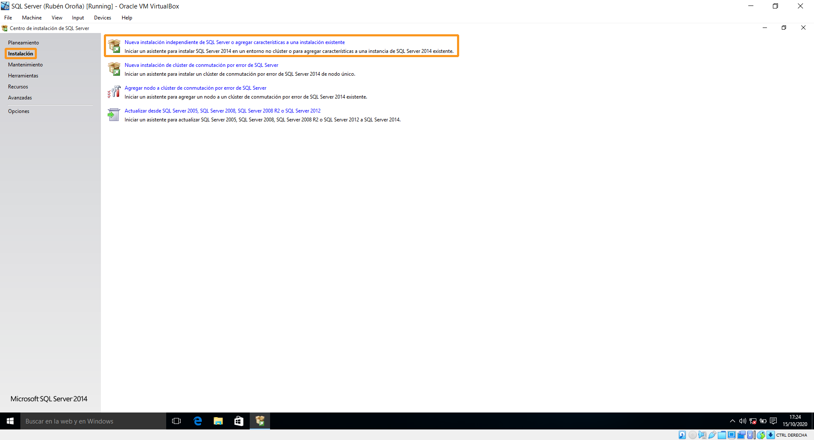
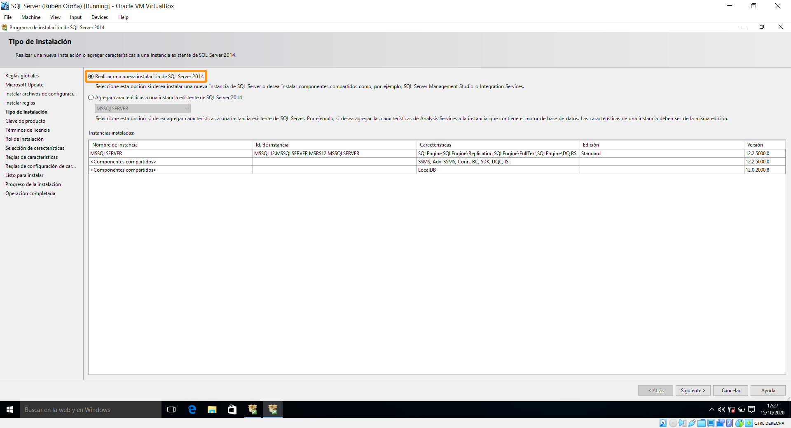
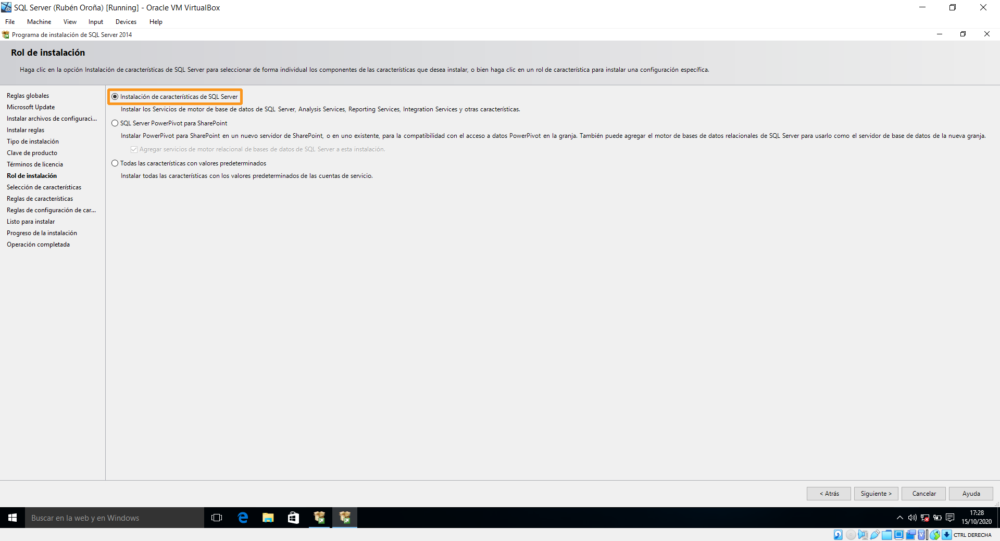
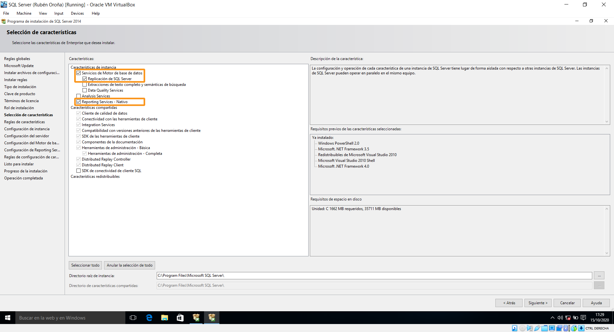
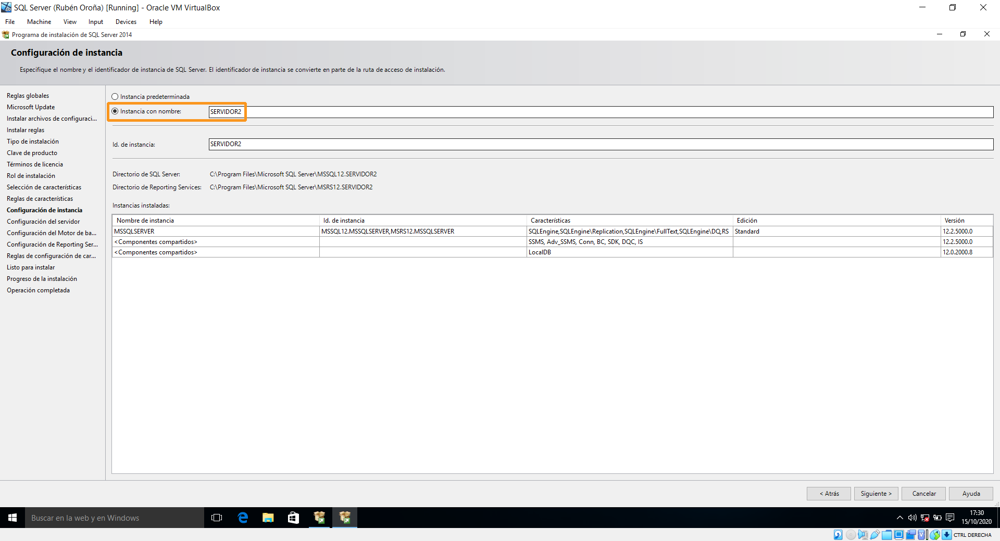
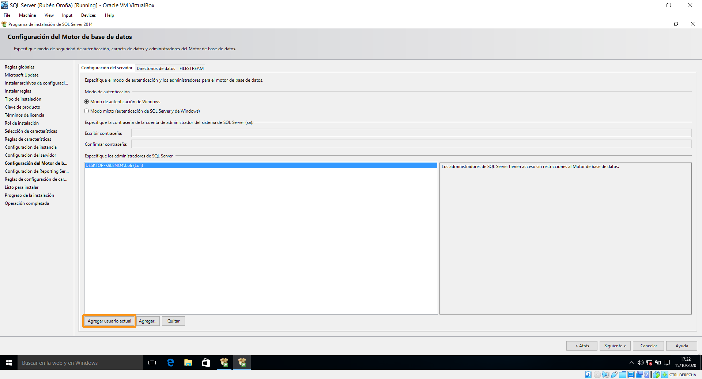
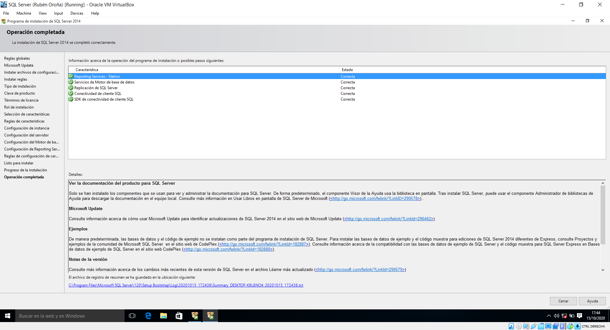
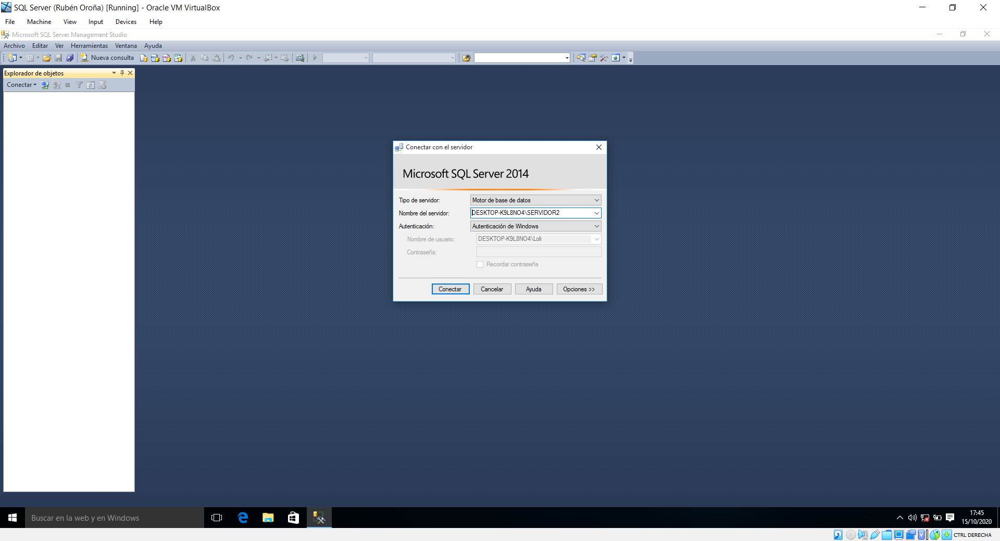
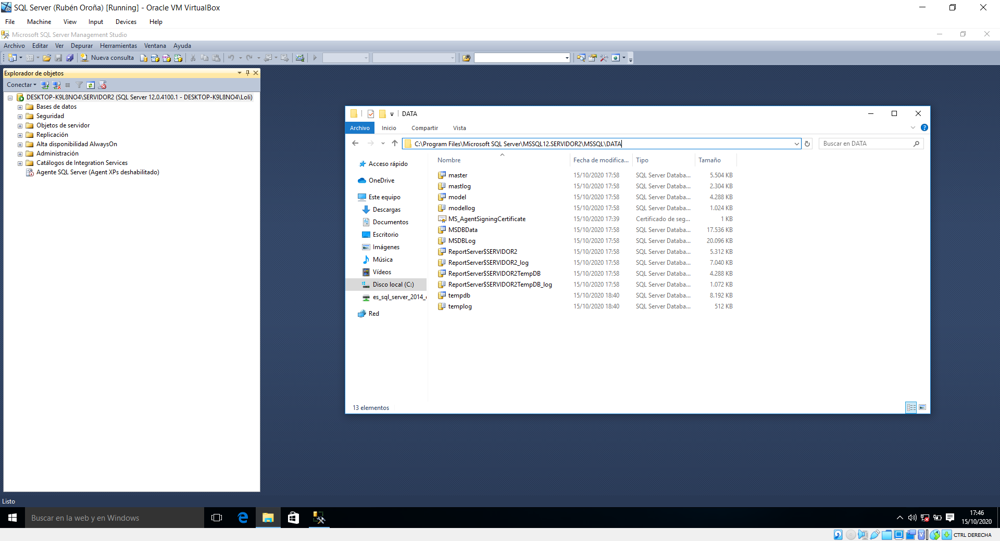

## 1.Instalación dun servidor Microsoft SQL Server

O obxectivo deste apartado será levar a cabo a instalación dunha nova instancia nun SQL Server 2014, tendo en conta que este xa conta cunha instancia primaria previa. Polo tanto, a base da práctica será a máquina virtual empregada en clase. Esta será importada a VirtualBox por motivos de familiaridade co propio software de virtualización.

Os únicos pasos previos antes de comezar o proceso de instalación consisten en arrancar o sistema sen conexión de rede, para posteriormente deshabilitar as actualizacións automáticas de Windows. Isto débese a que, tendo en conta que enfocamos este exemplo dende un punto de vista didáctico, o proceso rematará así máis axiña.

Así pois, comezamos a instalación inserindo na computadora a .iso de SQL Server 2014 Enterprise Edition de 32 bits. Tras isto, xa podemos arrancar o Centro de Instalación de SQL Server. Unha vez comprobamos que cumprimos os requirimentos de hardware e software, avanzamos á lapela de instalación e prememos na primeira opción.

Con isto aparecerá un asistente de instalación, que nos solicitará a ubicación do arquivo .iso que importamos anteriormente. Despois, rexeitamos a recomendación de empregar Windows Update e cancelamos calquera tipo de busca de actualización do produto. Cando cheguemos ó momento de escoller un tipo de instalación, optamos por crear unha nova instancia.

Nas seguintes ventás introducimos unha chave de activación válida para a versión Enterprise 2014, e aceptamos os termos de licenza (tras lelos, por suposto). No rol de instalación, escollemos a primeira opción, para escoller despois as características SQL.

Como xa temos unha instancia primaria configurada no sistema, contamos con varias características compartidas xa instaladas. En canto a nosa instancia, instalamos tres: 

- **Motor da base de datos**: o núcleo duro, que se encarga de almacenar, procesar e protexer toda a información das bases de datos.
- **Replicación de SQL Server**: permite copiar datos e obxectos de bases de datos, e logo poder sincronizalos dunha base a outra.
- **Reporting Services**: encárgase da parte analítica, permitindo crear, administrar e implementar informes tabulares, matriciais, gráficos e de forma libre.

A continuación, escollemos un nome para a nova instancia.

Tras avanzar, deixamos por defecto as contas de servizo. Posteriormente, optamos polo modo de autenticación de Windows. Damos por feito que na empresa emprégase un dominio que xa controla os permisos e privilexios de cada empregado. Neste caso, nós somos o usuario administrador de bases de datos e, polo tanto, encargarémonos de xestionar o MSSQL Server dende o noso usuario do dominio. Así pois, como xa estamos logueados, limitámonos a premer na opción de agregar usuario actual. 

Tras repasar o resumo final da configuración realizada no asistente, iniciamos a instalación. Despois duns minutos, o proceso remata con éxito.

A modo de comprobación, ímos conectarnos á nova instancia, que posteriormente empregaremos para crear a nosa base de datos.

