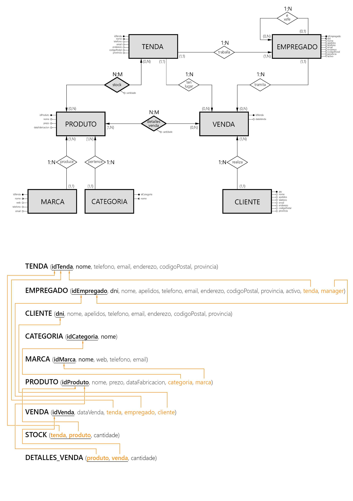

## 2. Recollida de información e deseño da base de datos

Requíresenos deseñar a base de datos dunha cadea de tendas informáticas. Estas sucursais só venden de maneira física, e non teñen planeado moverse ó mercado de pedidos online. A inauguración da primeira tenda tivo lugar en xaneiro do ano 2020. Así pois, debemos rexistrar os seguintes datos:

- ```Tenda```: id, nome, teléfono, email, enderezo, código postal e provincia.
- ```Empregado```: id, dni, nome, apelidos, teléfono, email, enderezo, código postal e provincia. Ademais, precisamos saber si o empregado se atopa en activo.
- ```Cliente```: dni, nome, apelidos, teléfono, email, enderezo, código postal e provincia. O cliente non está obrigado a aportar información sobre a súa localización xeográfica.
- ```Produto```: id, nome, prezo, e data de fabricación, non resultando imprescindible o rexistro destes último dato. Ademais, protexerase a base de datos para que ningún elemento poida saír á venda de balde.
- ```Categoría```: id e tipo de produto que se vende.
- ```Marca```: id, nome, sitio web, teléfono e email. Os datos sobre contacto coa empresa son de rexistro voluntario.
- ```Venda```: id e data de venda.

É preciso manter un control de todas as vendas que teñen lugar na empresa. Así pois, rexistraremos en que tenda tivo lugar cada transacción, o empregado que a xestionou e os produtos obtidos polo cliente. Ademais, cómpre detallar o número de exemplares de cada produto en todas as vendas.

Debemos rexistrar en que tenda traballa cada empregado. Ademais, teremos en conta que todos os empregados, salvo o xerente de cada tenda, teñen un xefe que tamén é un traballador da empresa.

Un empregado só traballa nunha tenda física, e non se eliminan os seus datos si deixa a empresa. Ademais, unha venda só é tramitada por un empregado.

Adicionalmente, temos que identificar a marca e o tipo de categoría ós que pertencen cada produto. Non os rexistraremos si a empresa non vende ningún produto desa categoría ou marca.

Por último, debemos levar un control do stock que acumulan as tendas de cada produto.

### Deseño conceptual e lóxico


