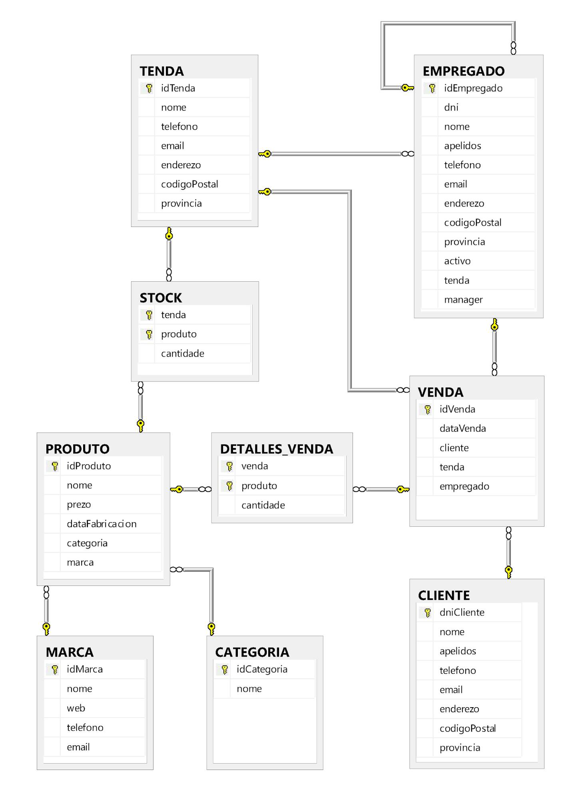

## 3. Implementación física da base de datos

Para crear a base de datos, aplicamos os conceptos DDL básicos recollidos nos [apuntamentos](https://github.com/rubenorona/SQL/blob/master/DDL.md). 

Criterios empregados para a xeración do código:

- Evitar acentos e espazos en branco na nomenclatura de obxectos, empregando unha letra maiúscula intercalada ou unha barra baixa como obxectos separadores.
- Táboas en maiúsculas, atributos en minúsculas. Aínda que sabemos que tanto Windows como SQL Server non son sensibles a isto, facémolo por estética e costume. Así pois, nun futuro poderemos manter o noso criterio para a definición de obxectos en PostgreSQL ou nun MariaDB instalado localmente en Linux.
- ```NOT NULL``` por defecto en todos os atributos, salvo nas claves primarias e nos datos de rexistro non obrigatorio.
- ```UNIQUE``` e ```PRIMARY KEY``` sempre de maneira simplificada, isto é, sen especificar o ```CONSTRAINT```, salvo cando están formadas por atributos compostos.
- - Atributo email con 320 carácteres máximos: 64 de nome de usuario + @ + 255 de nome de dominio.

Orde de inserción de datos: 

- Comprobación de existencia da base de datos e a súa posterior xeración.
- Creación de todas as táboas declarando o tipo de dato de cada atributo (xa que SQL Server non traballa con dominios), as claves primarias e as columnas de valor único.
- Despois disto, ```ALTER TABLE``` para engadir todas as claves alleas, dando nome manualmente a cada ```CONSTRAINT```.
- Finalmente, engadir as restricións de ```CHECK``` (tamén de forma moi declarativa e nomeándoos sempre).


Código da creación da base de datos en Microsoft SQL Server 2014:

```sql
USE master;
GO
IF DB_ID (N'informatica') IS NOT NULL
DROP DATABASE	informatica;
GO
CREATE DATABASE	informatica
ON (
        NAME		= informatica_dat,
        FILENAME	= 'C:\Program Files\Microsoft SQL Server\MSSQL12.SERVIDOR2\MSSQL\DATA\informaticadat.mdf',
        SIZE		= 10,
        MAXSIZE         = unlimited,
        FILEGROWTH	= 5 
)
LOG ON (
        NAME		= informatica_log,
        FILENAME	= 'C:\Program Files\Microsoft SQL Server\MSSQL12.SERVIDOR2\MSSQL\DATA\informaticalog.ldf',
        SIZE		= 5,
        MAXSIZE         = unlimited,
        FILEGROWTH	= 5
);
GO
USE informatica
GO

-- Creamos todas as táboas, definindo só restricións de clave primaria e unicidade

CREATE TABLE TENDA (
        idTenda		CHAR (5)	PRIMARY KEY,
        nome		VARCHAR (30)	NOT NULL	UNIQUE,
        telefono	CHAR (9)	NOT NULL,
        email		VARCHAR (320)	NOT NULL,
        enderezo	VARCHAR (50)	NOT NULL,
        codigoPostal	CHAR (5)	NOT NULL,
        provincia	VARCHAR (20)	NOT NULL
);
GO
CREATE TABLE CLIENTE (
        dni		CHAR (9)	PRIMARY KEY,
        nome		VARCHAR (30)	NOT NULL,
        apelidos	VARCHAR (50)	NOT NULL,
        telefono	CHAR (9)	NOT NULL,
        email		VARCHAR (320)	NOT NULL,
        enderezo	VARCHAR (50),
        codigoPostal	CHAR (5),
        provincia	VARCHAR (20)
);
GO
CREATE TABLE CATEGORIA (
        idCategoria	CHAR (5)	PRIMARY KEY,
        nome		VARCHAR (30)	NOT NULL        UNIQUE,
);
GO
CREATE TABLE MARCA (
        idMarca		CHAR (10)	PRIMARY KEY,
        nome		VARCHAR (30)	NOT NULL        UNIQUE,
        web		VARCHAR (200),
        telefono	CHAR (9),
        email		VARCHAR (320)
);
CREATE TABLE PRODUTO (
        idProduto	CHAR (15)	PRIMARY KEY,
        nome		VARCHAR (30)	NOT NULL,
        prezo		MONEY		DEFAULT 10000,
        dataFabricacion	DATE,
        categoria	CHAR (5)	NOT NULL,
        marca		CHAR (10)	NOT NULL
);
GO
CREATE TABLE VENDA (
        idVenda		CHAR (20)	PRIMARY KEY,
        dataVenda	DATE		NOT NULL,
        cliente		CHAR (9)	NOT NULL,
        tenda		CHAR (5)	NOT NULL,
        empregado	CHAR (15)	NOT NULL
);
GO
CREATE TABLE STOCK (
        tenda		CHAR (5)	DEFAULT 'almacen',
        produto		CHAR (15),
        cantidade	INT,
        CONSTRAINT PK_STOCK
		PRIMARY KEY (tenda, produto)
);
GO
CREATE TABLE DETALLES_VENDA (
        venda		CHAR (20),
        produto		CHAR (15),
        cantidade	INT,
        CONSTRAINT PK_DETALLES_VENDA
		PRIMARY KEY (venda, produto)
);
GO

-- Co contido xa creado, establecemos interrelacións entre táboas

ALTER TABLE EMPREGADO
        ADD
                CONSTRAINT FK_EMPREGADO_EMPREGADO
                        FOREIGN KEY		(manager)
                        REFERENCES EMPREGADO	(idEmpregado)
                        ON UPDATE  NO ACTION,
                --      ON DELETE  NO ACTION
                CONSTRAINT FK_TENDA_EMPREGADO
                        FOREIGN KEY		(tenda)
                        REFERENCES TENDA	(idTenda)
                        ON UPDATE  NO ACTION
                --      ON DELETE  NO ACTION
;
GO
ALTER TABLE PRODUTO
	ADD 
		CONSTRAINT FK_CATEGORIA_PRODUTO
			FOREIGN KEY		(categoria)
                        REFERENCES CATEGORIA	(idCategoria)
                        ON UPDATE  CASCADE,
                --      ON DELETE  NO ACTION
                CONSTRAINT FK_MARCA_PRODUTO
                        FOREIGN KEY		(marca)
                        REFERENCES MARCA	(idMarca)
                        ON UPDATE  CASCADE
                --      ON DELETE  NO ACTION
;
GO
ALTER TABLE VENDA
        ADD 
                CONSTRAINT FK_CLIENTE_VENDA
                        FOREIGN KEY		(cliente)
                        REFERENCES CLIENTE	(dni)
                        ON UPDATE  CASCADE,
                --      ON DELETE  NO ACTION
                CONSTRAINT FK_TENDA_VENDA
                        FOREIGN KEY		(tenda)
                        REFERENCES TENDA	(idTenda)
                        ON UPDATE  CASCADE,
                --      ON DELETE  NO ACTION
                

CONSTRAINT FK_EMPREGADO_VENDA
                        FOREIGN KEY		(empregado)
                        REFERENCES EMPREGADO	(idEmpregado)
                        ON UPDATE  CASCADE
                --      ON DELETE  NO ACTION
;
GO
ALTER TABLE STOCK
        ADD 
                CONSTRAINT FK_TENDA_STOCK
                        FOREIGN KEY		(tenda)
                        REFERENCES TENDA	(idTenda)
                        ON UPDATE  CASCADE
                        ON DELETE  SET DEFAULT,
                CONSTRAINT FK_PRODUTO_STOCK
                        FOREIGN KEY		(produto)
                        REFERENCES PRODUTO	(idProduto)
                        ON UPDATE  CASCADE
                --      ON DELETE  NO ACTION
;
GO
ALTER TABLE DETALLES_VENDA
        ADD 
                CONSTRAINT FK_VENDA_DETALLES_VENDA
                        FOREIGN KEY		(venda)
                        REFERENCES VENDA	(idVenda)
                        ON UPDATE  CASCADE,
                --      ON DELETE  NO ACTION
                CONSTRAINT FK_PRODUTO_DETALLES_VENDA
                        FOREIGN KEY		(produto)
                        REFERENCES PRODUTO	(idProduto)
                        ON UPDATE  CASCADE
                --      ON DELETE  NO ACTION
;
GO

-- Por último, realizamos as restricións de CHECK

ALTER TABLE TENDA
        ADD 
                CONSTRAINT telefonoTenda
                        CHECK (telefono LIKE '[0-9][0-9][0-9][0-9][0-9][0-9][0-9][0-9][0-9]'),
                CONSTRAINT emailTenda
                        CHECK (email LIKE '%_@__%.__%'),
                CONSTRAINT cpTenda
                        CHECK (codigoPostal LIKE '[0-9][0-9][0-9][0-9][0-9]')
;
GO
ALTER TABLE EMPREGADO
        ADD 
                CONSTRAINT dniEmpregado
                        CHECK (dni LIKE '[0-9][0-9][0-9][0-9][0-9][0-9][0-9][0-9][TRWAGMYFPDXBNJZSQVHLCKET]'),
                CONSTRAINT telefonoEmpregado
                        CHECK (telefono LIKE '[0-9][0-9][0-9][0-9][0-9][0-9][0-9][0-9][0-9]'),
                CONSTRAINT emailEmpregado
                        CHECK (email LIKE '%_@__%.__%'),
                CONSTRAINT cpEmpregado
                        CHECK (codigoPostal LIKE '[0-9][0-9][0-9][0-9][0-9]')
;
GO
ALTER TABLE CLIENTE
        ADD 
                CONSTRAINT dniCliente
                        CHECK (dni LIKE '[0-9][0-9][0-9][0-9][0-9][0-9][0-9][0-9][TRWAGMYFPDXBNJZSQVHLCKET]'),
                CONSTRAINT telefonoCliente
                        CHECK (telefono LIKE '[0-9][0-9][0-9][0-9][0-9][0-9][0-9][0-9][0-9]'),
                CONSTRAINT emailCliente
                        CHECK (email LIKE '%_@__%.__%'),
                CONSTRAINT cpCliente
                        CHECK (codigoPostal LIKE '[0-9][0-9][0-9][0-9][0-9]')
;
GO
ALTER TABLE MARCA
        ADD 
                CONSTRAINT telefonoMarca
                        CHECK (telefono LIKE '[0-9][0-9][0-9][0-9][0-9][0-9][0-9][0-9][0-9]'),
                CONSTRAINT emailMarca
                        CHECK (email LIKE '%_@__%.__%')
;
GO
ALTER TABLE PRODUTO
        ADD CONSTRAINT nadaDeBalde
			CHECK (prezo > 0)
;
GO
ALTER TABLE VENDA
        ADD CONSTRAINT nonAntesDo2020
			CHECK (dataVenda >= '2020-01-01')
```

### Diagrama da base de datos en SQL Server


