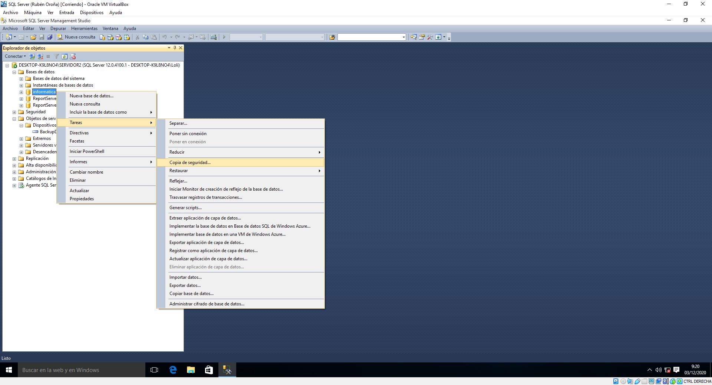

## 5. Política de copias de seguridade: plan e métodos

Aínda que a nosa empresa non teña a transcendencia dun banco, tampouco nos interesa deixar de lado a seguridade dos datos manexados. Polo tanto, resulta imprescindible trazar unha estratexia de backups automatizadas, para evitar a perda de información en caso de xurdir imprevistos.

Tras estudar os tipos de copias de seguridade que podemos realizar, o **modelo de recuperación** que se adecúa ás nosas necesidades é o completo. Por un lado, o modelo de recuperación **simple** non permite a copia do rexistro de transaccións, podendo realizar só backups completas ou diferenciais. Por outra banda, non consideramos conveniente o **rexistro masivo**, pois o arquivo de log pode acadar un tamaño demasiado grande.

Así pois, o plan deseñado é o seguinte: 

- Unha copia de seguridade completa todos os domingos á 1:00 h.
- Unha copia diferencial todos os días, tamén á 1:00 h.
- Unha copia de rexistro de transaccións cada hora, de 7:00h a 21:00h.

Todas as copias serán, como dixemos, con modelo de recuperación completo. Consideramos suficiente unha copia semanal de toda a base de datos. Entre medias, só seis copias diferenciais farán que a última teña un tamaño manexable. Por último, semella óptimo un backup do rexistro de transaccións cada hora, pero só durante as horas activas da empresa.

Como todo o feito ata agora, para realizar unha copia de seguridade tamén contamos con dous métodos diferentes: interface gráfica ou código Transact-SQL. Comezamos por amosar a primeira opción. O máis adecuado á hora de xerar backups consiste en crear un novo dispositivo, no que se almacenarán as copais de seguridade. Este dispositivo terá a extensión .bak e atópase no cartafol */Backup* do directorio do noso servidor.


Xa que nos decidimos antes por empregar o método de recuperación completo, cómpre comprobar que esta é a opción escollida na database a copiar. Para elo, facemos clic dereito na nosa base de datos, prememos en propiedades e imos á lapela opcións.


Con todo listo, xa podemos iniciar a primeira copia de seguridade. Isto realízase facendo clic dereito na base de datos a copiar, despregar o menú tarefas e escollendo a opción copias de seguridade.




Na primeira lapela, escollemos a base de datos a copiar e agregamos o dispositivo onde se almacenará. Xa que se trata da primeira copia que imos realizar, esta deberá ser completa.


En canto ó resto dos parámetros, optamos polos valores predeterminados. A modo de exemplo, creamos tamén a copia do rexistro de transaccións. Podemos atopar todos os backups realizados accedendo ó dispositivo de copias e consultando o seu contido.


Agora que xa sabemos realizar copias de seguridade, imos ver como restauralas. O primeiro paso consiste en volver ás propiedades da database, e establecer unha restrición de acceso single-user. Naturalmente, isto provocará a desconexión do resto de usuarios da base de datos. Ademais, así evitamos que esta sufra modificacións non controladas durante o proceso de restauración.


Adicionalmente, realizaremos unha derradeira copia de seguridade do rexistro de transaccións. Neste caso, temos que ir a opcións de medios, co fin de marcar a xanela copia do final de rexistro, que ademais deixará a base de datos en modo de restauración.


Coa base de datos en modo de restauración, iniciamos esta facendo clic dereito na base de datos, e despregando o menú tarefas.


No plan de restauración, debemos seleccionar:

- a última copia de seguridade completa.
- a derradeira copia diferencial (si fose realizada tras a completa).
- todas as copias do rexistro de transaccións posteriores á copia de seguridade completa que temos como referencia. 

Ademais, o último elemento a restaurar será sempre a copia do final de rexistro.


Tras rematar a restauración, volvemos a establecer a base de datos en modo multi-user.


O proceso de copiar e restaurar unha base de datos segue exactamente os mesmos pasos se a realizamos mediante código Transact-SQL: creamos un dispositivo, xeramos as copias necesarias, poñemos a base de datos en modo single-user, realizamos a copia final de rexistro, restauramos os arquivos precisos e volvemos a permitir o acceso multiusuario.

```sql
-- Creación dun novo dispositivo para non ter que eliminar o anterior

USE master
GO
EXEC sp_addumpdevice 'disk', 'BackupDevice2', 'C:\Program Files\Microsoft SQL Server\MSSQL12.SERVIDOR2\MSSQL\Backup\BackupDevice2.bak';
GO

-- Comenzamos cunha copia completa da base de datos

BACKUP DATABASE informatica
        TO BackupDevice2;
GO

-- Facemos despois unha copia diferencial

BACKUP DATABASE informatica
        TO BackupDevice2
        WITH DIFFERENTIAL;
GO

-- Realizamos tamén unha copia do rexistro de transaccións

BACKUP LOG informatica
        TO BackupDevice2;
GO

-- Poñemos a base de datos en modo usuario único

ALTER DATABASE informatica
        SET SINGLE_USER
        WITH ROLLBACK IMMEDIATE;
GO

-- Facemos a copia de final de rexistro

BACKUP LOG informatica
        TO BackupDevice2
        WITH NORECOVERY;
GO

-- Primeiro restauramos o arquivo que garda a última copia completa

RESTORE DATABASE informatica
        FROM BackupDevice2
        WITH FILE = 1,
                NORECOVERY;
GO

-- Despois aplicamos a última copia diferencial

RESTORE DATABASE informatica
	FROM BackupDevice2
	WITH FILE = 2,
                NORECOVERY;
GO

-- A continuación, aplicamos os arquivos de LOG

RESTORE LOG informatica
	FROM BackupDevice2
	WITH FILE = 3,
                NORECOVERY;
GO

-- Rematamos coa copia de final de rexistro
-- Con RECOVERY no último elemento, damos comezo ó proceso

RESTORE LOG informatica
	FROM BackupDevice2
	WITH FILE = 4,
                RECOVERY;
GO

-- Volvemos a poñer a base de datos en modo multiusuario

ALTER DATABASE informatica
        SET MULTI_USER;
```
