## 6. Automatización das copias de seguridade

No paso anterior levamos a cabo dous exemplos sinxelos de copias de seguridade e restauración das mesmas, tanto dende a interface gráfica como mediante comando. Sen embargo, unha tarefa tan importante e de carácter periódico non se debería realizar manualmente. 

Así pois, imos implementar o plan de mantemento que deseñamos previamente: 

- Unha copia de seguridade completa todos os domingos á 1:00 h.
- Unha copia diferencial todos os días, tamén á 1:00 h.
- Unha copia de rexistro de transaccións cada hora, de 7:00h a 21:00h.

Este tipo de tarefa, igual que o resto de xestións automatizadas, será xestionada polo SQL Server Agent. Este compoñente non é común a todas as instancias instaladas nun mesmo equipo, senón que cada unha conta cun axente propio.

Polo tanto, o primeiro que debemos facer é executar services.msc en Windows, co fin de atopar o servizo SQL Server Agent correspondente á nosa instancia. Tras isto, iniciámolo e facemos que se execute de xeito automático. 

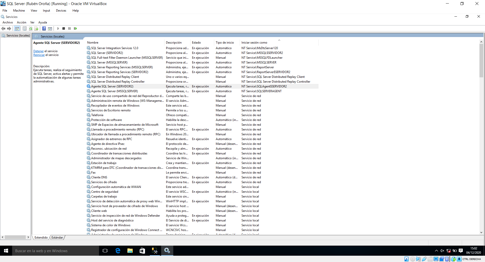

Para crear un plan de mantemento, podemos optar por facelo paso a paso dende cero ou ir guiado por un asistente. Por sinxeleza, escollemos esta última opción facendo clic en *Administración/ Planes de mantenimiento*. Os primeiros parámetros que imos cubrir son un nome para o plan, e marcar a xanela que nos permite programar cada tarefa de maneira independente.

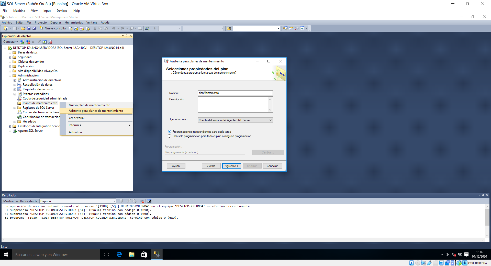

Na seguinte pantalla, escollemos a copia de seguridade completa, diferencial e rexistro de transaccións, nesta orde.

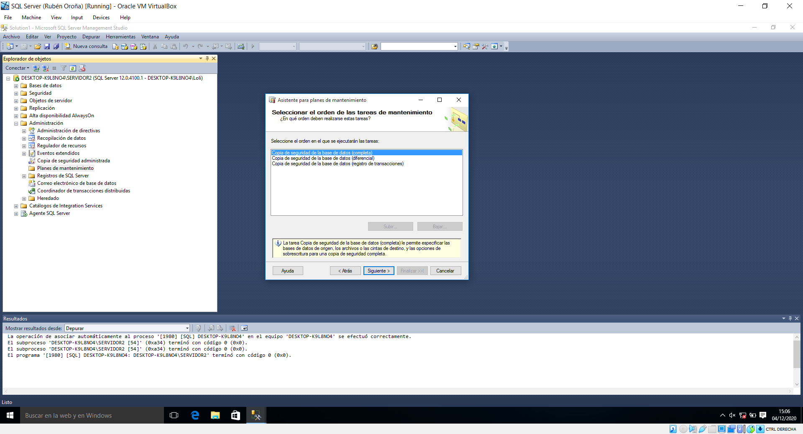

Nos tres tipos de copias a programar, escollemos a nosa base de datos.

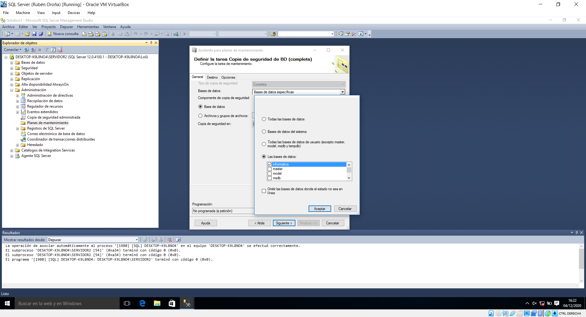

Outro elemento común será elixir a ubicación destas copias, que será o primeiro dispositivo de seguridade que creamos.

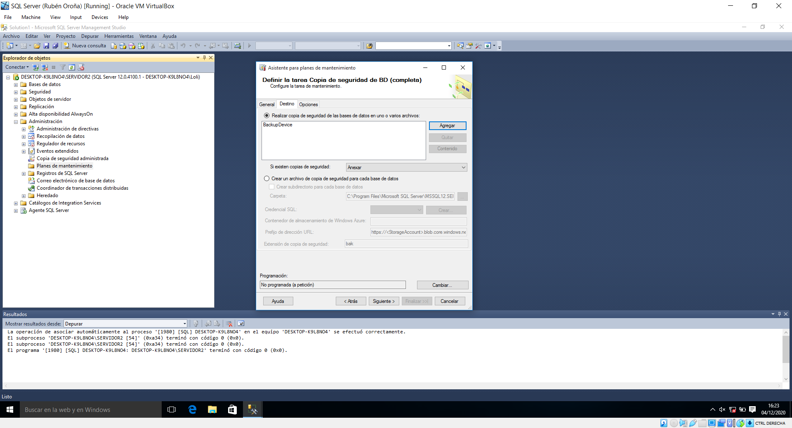

Agora imos a definir a programación para cada subtarefa. No tocante ás copias completas, establecemos unha frecuencia semanal, producíndose o backup todos os domingos á 1:00h. 

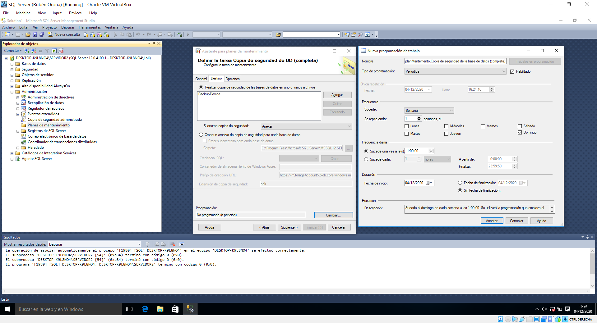

En canto ás copias diferenciais, estas terán lugar diariamente á 1:00h.

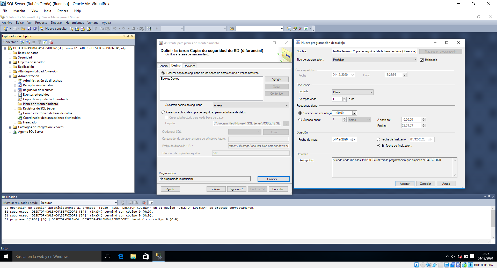

Por último, os rexistros de transaccións serán copiados diariamente cada hora, de 7:00h a 21:00h.

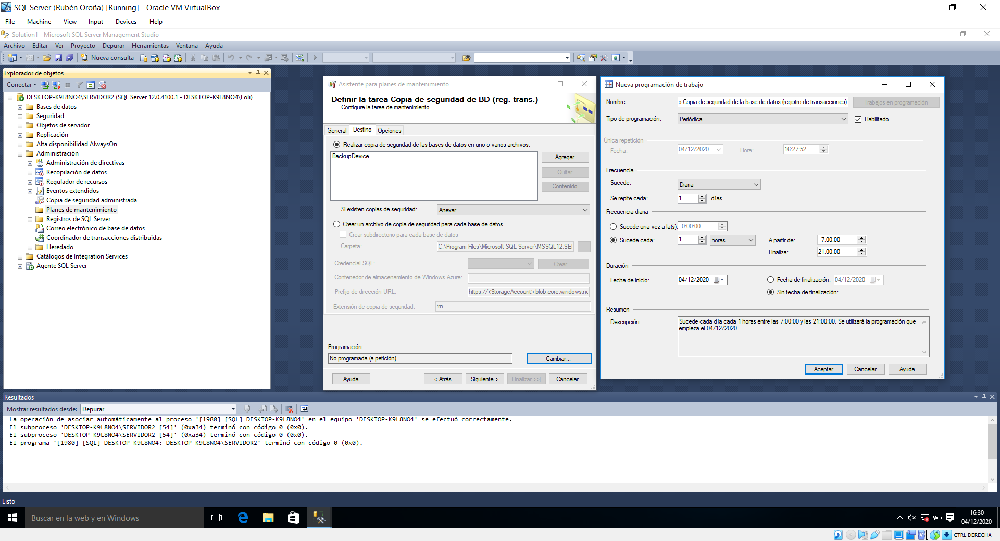

Con isto, xa creamos o plan de mantemento. Para realizar posteriores modificacións nel, podemos abrilo en *Administración/ Planes de mantenimiento/nomeDoPlan*. Aí, podemos despregar o menú de ferramentas da esquerda e realizar múltiples operacións.

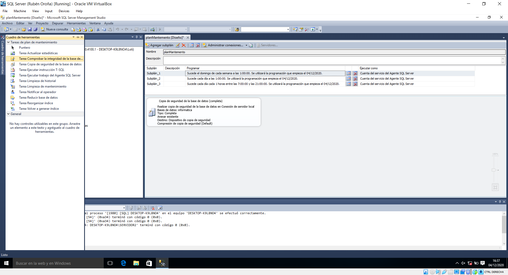

No noso caso, imos configurar que, xunto coa copia completa semanal, se realice unha comprobación da integridade da base de datos. Para elo, arrastramos a opción dende o menú de ferramentas da esquerda. Facemos dobre clic na nova tarefa para elixir a nosa base de datos.

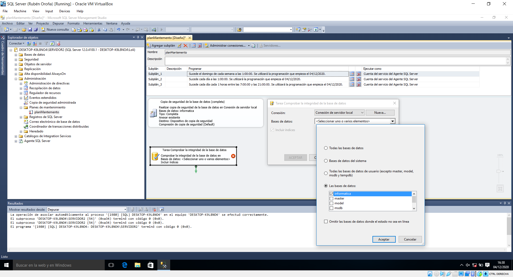

Tras configurar esta tarefa, unímola coa subtarefa correspondente á copia de seguridade completa na mesa de traballo. Se non queremos esperar ó día e hora escollidos para que se produzan as backups, podemos forzar a súa execución dende o directorio traballos que se atopa dento do Axente SQL. 

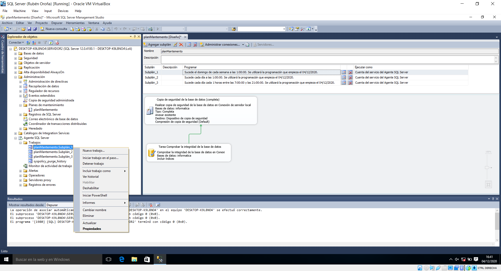

Tras iniciar manualmente as tres subtarefas, podemos atopalas no dispositivo de copias de seguridade. 

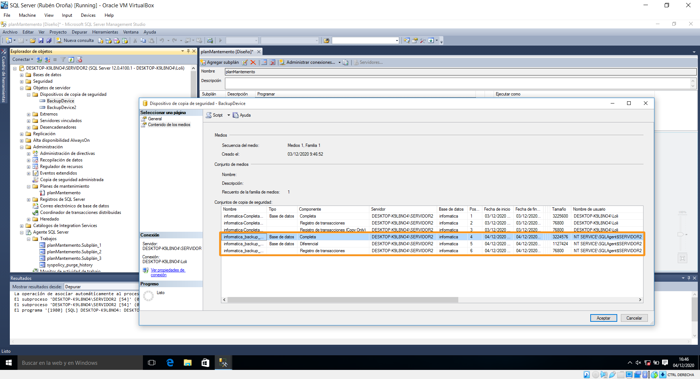
