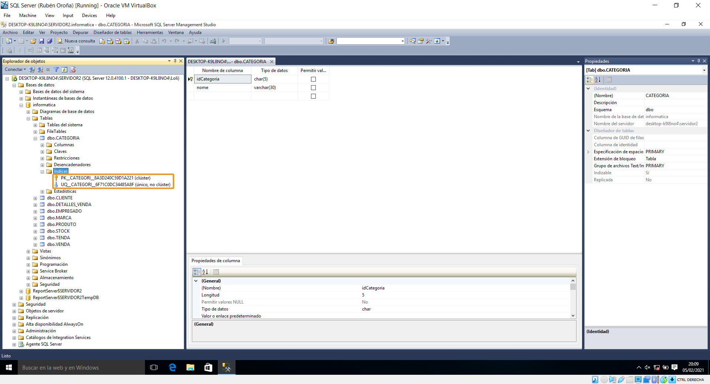
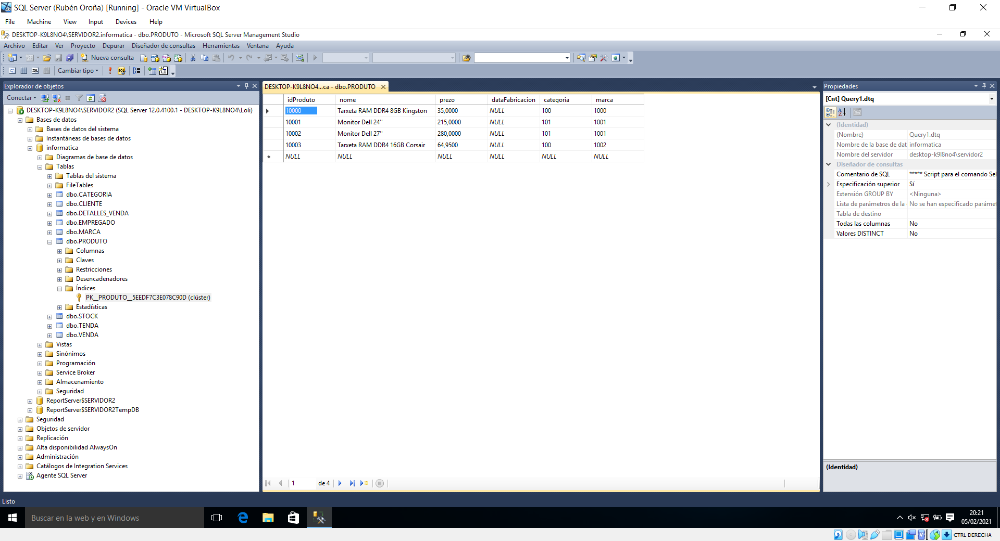
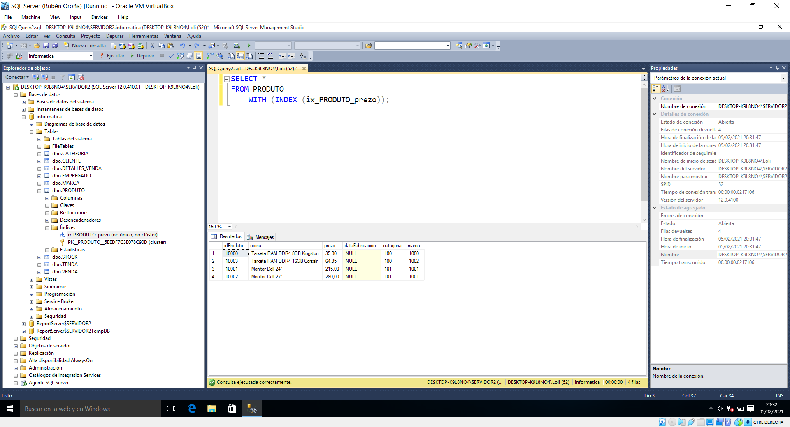

## 8. Conceptos e creación de índices

Antes de levar a cabo a creación dun índice na nosa base de datos, cómpre primeiro estudar que son e para que serven. Así pois, podemos dicir que un índice é unha estrutura dentro dunha base de datos que, mediante punteiros, referencia os valores dunha táboa (ou vista). Pode incluso entenderse como unha redundancia de datos: require do seu propio espazo de almacenamento en disco, non cambia os datos dunha táboa e simplemente contén unha copia. Pero, igual que ocorre co índice dun libro, o proceso de busca resulta moito máis áxil.

Existen dous tipos de índices: **agrupados** e non agrupados. Os primeiros, coñecidos tamén como *clustered*, determinan a orde na cal os datos son fisicamente almacenados, en función da clave do índice. Como os datos dunha táboa só poden estar ordenados dunha maneira, unicamente poderá existir un índice agrupado por táboa.

Por outra banda, os índices **non agrupados** (*nonclustered*) teñen unha estrutura independente das filas dos datos. Neste caso, cada entrada de valor ten un punteiro á fila de datos na que se atopa a clave. Deste xeito, unha busca sobre un índice non agrupado é máis lenta, xa que o sistema ten que realizar un paso extra (consultar o índice para atopar a dirección de busca da fila, e despois ir a esta para obter outros valores de columna). Cando creamos manualmente un índice, por defecto será non agrupado.

Sen embargo, algúns índices xa son creados de xeito automático. Concretamente os debidos ás columnas ```PRIMARY KEY``` e ```UNIQUE```. No caso das claves primarias, créase o índice agrupado da táboa (naturalmente con valores únicos). Isto último tamén o cumpren os tipos de atributo ```UNIQUE```, aínda que xerándose como índices nonclustered ou de tipo non agrupado.

Xa vimos que os índices pertencen a táboas ou vistas, polo que será aí onde poidamos atopar os índices creados ou xerar outros dende a interface gráfica (xa veremos máis adiante como crear un mediante código). Dun xeito práctico, consultaremos os índices predeterminados dunha táboa da nosa base de datos, que ademais de PK teña tamén unha columna de valor único. Así pois, imos a *Bases de datos del sistema/informatica/Tablas/dbo.CATEGORIA/Índices*.




Como vemos na captura superior, na táboa ```CATEGORIAS``` temos dous índices xa creados. Por un lado, a clave primaria *idCategoria* xera o índice agrupado, mentres que o atributo de restrición ```UNIQUE``` *nome* conta cun índice non agrupado de valor único.




Agora imos a xerar un novo índice. Este queremos que sexa na táboa ```PRODUTO``` amosada arriba. Nela só existe o índice agrupado da clave principal. Así pois, a nosa intención será crear un índice non agrupado na columna *prezo*, que ordene de máis baratos a máis caros os produtos rexistrados.

Como *nonclustered* é a opción por defecto, non é preciso especificala. Neste caso, si que se aceptan valores multivaluados. Así pois, executamos o seguinte código:

```sql
USE informatica;
GO
CREATE /*NONCLUSTERED*/ INDEX ix_PRODUTO_prezo
ON PRODUTO (prezo ASC)
;
```


Como xa dixemos antes, os datos da táboa e o índice almacénanse en lugares diferentes. Os rexistros da táboa son almacenados por un índice agrupado (neste caso, o da clave primaria). O noso índice será ordenado dacordo a súa definición (prezo ascendente) e almacenado separadamente dende a táboa.

Podemos consultar o índice anterior se especificamos en ```FROM``` que empregue se maneira específica o noso índice (```WITH INDEX```). Isto facémolo porque queremos probar, dende un punto de vista didáctico, o índice que acabamos de crear.




Como podemos ver, os valores xa non aparecen ordenados pola clave primaria de *idProduto*, senón polo prezo. Sen embargo, cómpre destacar que non é necesario forzar ó sistema a empregar un índice, senón que xa o empregará (ou non) de xeito automático en función dos datos almacenados e a consulta realizada. Como no noso exemplo contamos con táboas con moi poucas tuplas rexistradas, a creación de índices adicionais non é realmente necesaria. 
