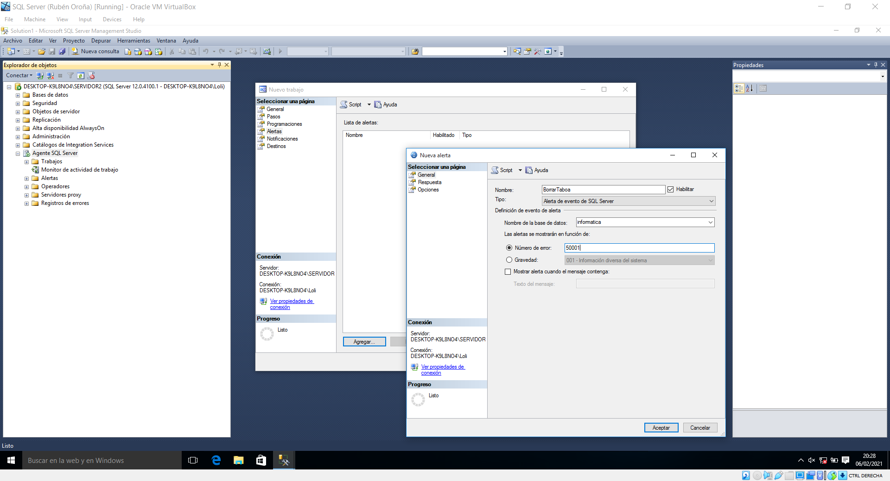

## 9. Mensaxes de erro, alertas e desencadenadores

Cando se produce algún tipo de erro en SQL Server, amósasenos unha advertencia describindo o motivo do fallo. Estas mensaxes de erro están rexistradas de maneira predeterminada no sistema, aínda que nós tamén podemos crear erros personalizados. Para consultalas todos, debemos buscar o contido de *sysmessages*, dentro da base de datos *master*. Como as mensaxes aparecen en varios idiomas, buscaremos só as rexistradas en español (coa ID de lingua 3082).


No noso caso, atopamos un total de 11.466 mensaxes de erro só en español. Aparte da ID de mensaxe e a descrición do erro, cómpre destacar outra columna. Referímonos á de severidade, que clasifica cada erro nunha escala de gravidade entre 0 e 25. De menos a máis grave, diferenciamos: 

- ```0-9```	Mensaxes de información de estado ou erros non son graves. O motor da base de datos non amosa os erros dentro destes niveis.
- ```10```	Similar ós anteriores. Estas mensaxes si que son amosados polo motor de base de datos, que aparecerán convertidos como erros de nivel 0.
- ```11-16```	Mensaxes que indican erros que poden ser solucionados polo usuario. Por exemplo, que o obxecto nomeado nunha sentenza non existe ou que non se teñen suficientes privilexios para levar a cabo unha determinada acción.
- ```17-19```	Erros de software que non poden ser solucionados polo usuario.
- ```20-25```	Son as mensaxes máis severas de todas, e indican problemas do sistema e son erros fatais. Pode incluso significar que obxectos ou bases resultaron danados.

Agora, imos rexistrar a nosa propia **mensaxe de erro** mediante a sentenza *sp_addmessage*. A ID da mensaxe debe ser maior a 50.000. A nosa intención é que esta mensaxe apareza cando un usuario trate de eliminar unha táboa da nosa base de datos. Así pois, como nivel de gravidade escollemos o 16 (solucionables polo usuario). Ademais, deberemos primeiro rexistrar a mensaxe en inglés, e despois podemos escribir o seu equivalente noutra lingua.

```sql
EXEC sp_addmessage 50001, 16,
        'Deleting any table in this database is prohibited',
        'us_english'
;
GO
EXEC sp_addmessage 50001, 16,
        'Está prohibido eliminar unha táboa desta base de datos',  
        'spanish'
;
```


Máis adiante indicaremos como faremos para que esta mensaxe de erro salte no momento oportuno. Sen embargo, o que faremos agora será configurar unha **alerta** que programe certas operacións cada vez que esta mensaxe salte no sistema. Como toda tarefa programable, faise dende o Agente SQL Server.

Así pois, facemos clic dereito no Agente SQL e prememos en novo traballo. Na lapela de pasos, podemos configurar, mediante código Transact-SQL, as accións a tomar cada vez que salte a alerta. No noso caso, o primeiro paso será que se realice unha copia de seguridade completa da base de datos.


Configuraremos un segundo paso, que comprobará a integridade da base de datos. Repetimos o mesmo proceso, pero co código ```DBCC CHECKDB```. Despois, imos á lapela Alerta, onde relacionamos estas accións a tomar coa mensaxe de erro creada. Deste xeito, establecemos manualmente o número de erro 50.001 e escollemos como ámbito de incidencia a nosa base de datos.




Xa creamos unha mensaxe de erro e configuramos unha alerta para establecer os pasos a seguir en caso de que esta salte. Só falta especificar en que momento debe o sistema devolver tal mensaxe de erro. Isto realízase cun **desencadenador** (trigger). Estes poden realizarse a tres niveis: servidor, base de datos e táboa. Neste caso, o noso trigger será configurado a nivel de base de datos, e nel debemos indicar, mediante Transact-SQL, que a mensaxe de erro apareza cando se elimine unha táboa.

```sql
USE informatica;
GO
CREATE TRIGGER borrarTaboa
ON DATABASE
FOR DROP_TABLE
AS
  RAISERROR (50001, 16, 1) WITH LOG
  ROLLBACK
;
```


Este trigger de base de datos atópase almacenado como obxecto en *Bases de datos/informatica/Programación/Desencadenadores de bases de datos*. Con todo listo, só queda probar si funciona. Para isto, creamos unha nova táboa de proba chamada *borrar*. Se tratamos de eliminala mediante a interface gráfica ou por código, o sistema devólvenos a mensaxe de erro que personalizamos e non nos permite a acción.


Comprobamos ademais que se levaron a cabo os dous pasos que establecemos na alerta. Para elo, imos ó directorio traballos dentro do Agente SQL Server. Nel, podemos consultar o historial, onde vemos que a alerta se executou dúas veces (unha tratando de eliminar a táboa por GUI e outra por código).


