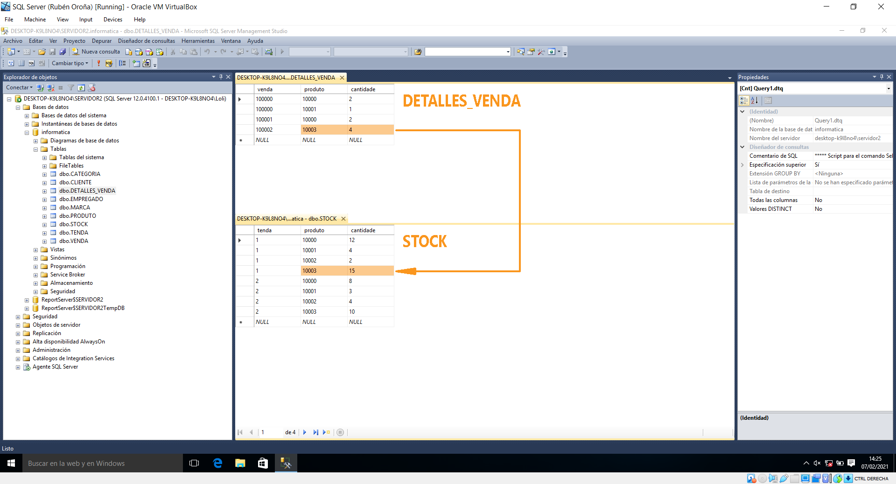
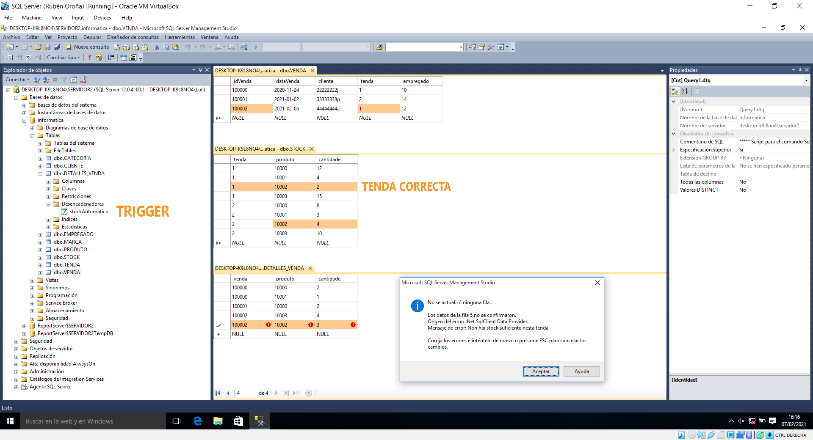
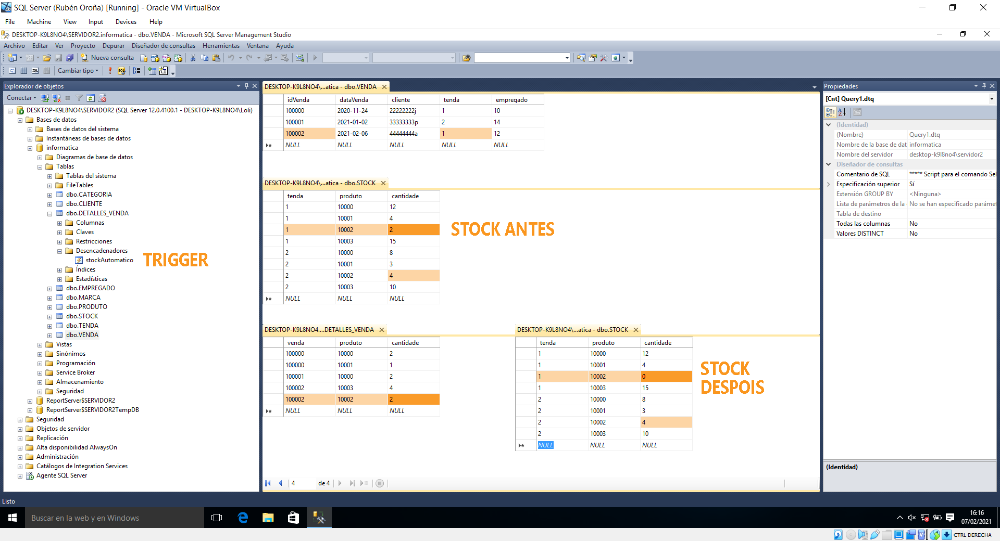

## 10. Desencadenador DML

Como xa vimos durante o anterior apartado, un **trigger** emprega sentenzas Transact-SQL para desencadenar unha ou varias accións. Estas poden ter incidencia a **tres niveis** diferentes: servidor, base de datos e táboa. O trigger que fixemos antes para empregalo xunto coa mensaxe de erro personalizada foi de tipo DDL, porque o seu ámbito ocupaba toda a base de datos. Neste caso, optamos por definir un desencadenador a nivel de táboa.

Dentro dos triggers DML, estes poden controlar tres posibles operacións dentro dunha táboa: traballar con campos calculados, manter as regras de negocio ou manter a integridade referencial. Nos centrarémonos no primeiro tipo. Así pois, pretendemos que, cada vez que rexistremos un pedido, a cantidade de produtos vendidos se actualice na táboa de ```STOCK```.




Fúmonos atopando con diversas dificultades no proceso de deseño do trigger ata dar co código final, aínda que ó final eran bastante sinxelos de solucionar. O primeiro que fixemos foi identificar as táboas implicadas. Por un lado, o desencadenador irá ubicado na táboa ```DETALLES_VENDA``` porque é onde rexistramos a cantidade de elementos de cada produto que son vendidos. Por outra banda, a táboa que queremos actualizar é a de ```STOCK```, onde levamos un control de almacén de cada tenda.

Este é o código inicial que probamos e que senta as bases do trigger final: 

```sql
USE informatica;
GO
CREATE TRIGGER stockAutomatico
ON DETALLES_VENDA AFTER INSERT
AS
        UPDATE STOCK
        SET STOCK.cantidade = STOCK.cantidade - (SELECT cantidade FROM INSERTED)
        WHERE produto = (SELECT produto FROM INSERTED)
;
```


Precisamos consultar a táboa ```INSERTED```, que é manexada automaticamente polo sistema e rexistra de maneira temporal as derradeiras tuplas rexistradas. Tamén empregamos a sentenza ```AFTER INSERT``` porque queremos que se realice a actualización de stock unha vez os detalles da venda de cada produto foron rexistrados. Isto permítenos restar o stock orixinal menos a cantidade mercada.

Sen embargo, co código superior xúrdenos o primeiro problema: non especificamos a tenda na que se produciu a venda. Isto resulta en que, cada vez que rexistremos unha venda, réstase esa cantidade de produtos en todas as sedes nas que houbese stock. A solución consiste en engadir unha segunda condición no ```WHERE```, implicando unha terceira táboa ```VENDA```. Nela si que aparece especificada a tenda na que se produciu a operación, polo que podemos comparar ese valor coa ID de tenda que temos na táboa ```STOCK```.

```sql
USE informatica;
GO
CREATE TRIGGER stockAutomatico
ON DETALLES_VENDA AFTER INSERT
AS
        UPDATE STOCK
        SET STOCK.cantidade = STOCK.cantidade - (SELECT cantidade FROM INSERTED)
        WHERE produto = (SELECT produto FROM INSERTED)
                AND STOCK.tenda = (
                        SELECT tenda
                        FROM VENDA
                        WHERE idVenda = (SELECT venda FROM INSERTED)
                )
;
```

Grazas a esa subconsulta que realizamos, agora só se produce a resta de stock na tenda correcta. Só faltaría coidar un detalle máis: si vendemos nunha tenda máis produtos dos que temos almacenados, a táboa de stock ponse en números negativos. Como isto non ten sentido, melloramos o código empregando o condicional ```IF```, mediante o que comprobamos que as existencias dun produto nunha tenda son iguais ou maiores ás que se van a vender. No caso contrario (```ELSE```), xeramos unha mensaxe de erro e impedimos a operación.

```sql
USE informatica;
GO
CREATE TRIGGER stockAutomatico
ON DETALLES_VENDA AFTER INSERT
AS
        IF (SELECT cantidade
                FROM STOCK
                WHERE produto = (SELECT produto FROM INSERTED)
                        AND tenda = (
                                SELECT tenda
                                FROM VENDA
                                WHERE idVenda = (SELECT venda FROM INSERTED)
                                )
                ) >= (SELECT cantidade FROM INSERTED)
        UPDATE STOCK
        SET STOCK.cantidade = STOCK.cantidade - (SELECT cantidade FROM INSERTED)
        WHERE produto = (SELECT produto FROM INSERTED)
                AND tenda = (
                        SELECT tenda
                        FROM VENDA
                        WHERE idVenda = (SELECT venda FROM INSERTED)
                        )
        ELSE
                RAISERROR('Non hai stock suficiente nesta tenda',16,1)
;
```


O novo desencadenador podemos atopalo almacenado en *Bases de datos/informatica/Tablas/dbo.DETALLES_VENDA/Desencadenadores*. En primeiro lugar, imos probar que o trigger impide que se rexistre a venda si non hai produtos suficientes na tenda correcta, e despois que a resta de stock é correcta.

Do produto 10.002 temos dúas existencias almacenadas na tenda1 e catro na tenda2. Deste xeito, tratamos de rexistrar a compra de tres deses produtos, unha venda (id 100.002) que se produciu na tenda1 (como se pode ver na táboa de ```VENDA```). Así pois, comprobamos:

- Que a venda non se produza, porque na tenda1 non hai suficiente stock para levala a cabo.
- Que o trigger diferencia entre tendas, porque na tenda2 si que se podería realizar a operación.

As tres táboas implicadas no trigger, co erro que devolve o sistema:




Como se pode observar na captura superior, o sistema devólvenos o erro que deriva do ```ELSE``` establecido na condición do código, porque en primeiro lugar comproba que haxa stock dese produto só na tenda na que se produciu a venda. Que si haxa existencias na outra tenda é irrelevante.

Imos agora a facer unha proba de venda válida na que se produza a resta de stock tras rexistrar os detalles. Repetimos o rexistro de venda, do mesmo produto e tamén na tenda1. Sen embargo, neste caso só apuntamos dous elementos, xusto o stock restante en dita sede. Como se pode observar na captura inferior, o sistema non devolve erros. O stock do produto 10.002 na tenda1 pasa de ser dous a cero. Sen embargo, os produtos da tenda2 non se ven alterados.


