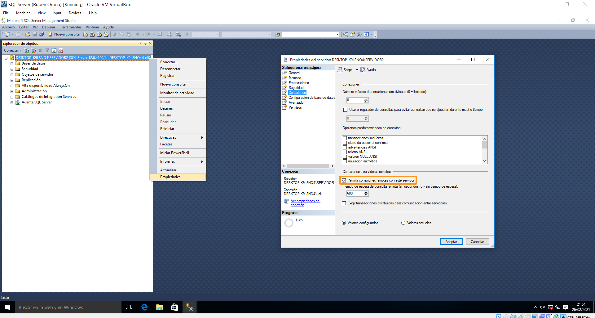
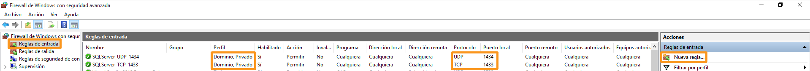
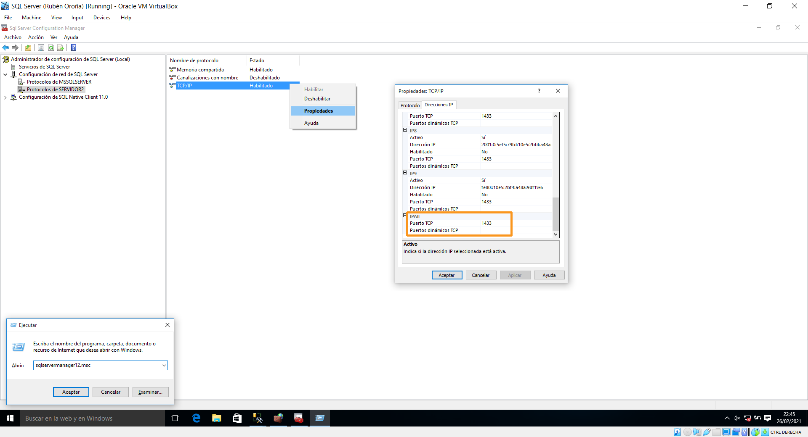
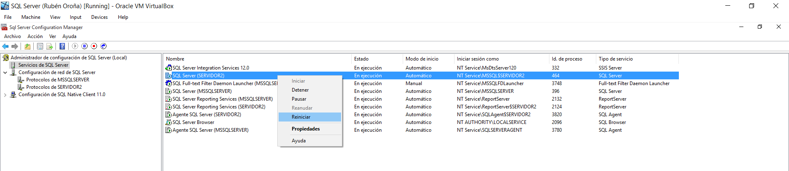

## 11. Configuración de superficie para o acceso remoto

Neste apartado veremos os pasos necesarios para poder establecer unha conexión remota ó motor da base de datos de SQL Server. No noso caso, contamos con dúas instancias dentro do mesmo servidor, polo que conectalas entre elas é poder traballar en ambas de xeito simultáneo non ten dificultade. Sen embargo, nunha contorna real de produción pode ser moi interesante poder manexar o servidor SQL Server dende un equipo cliente. En primeiro lugar, precisaremos que o usuario que pretenda realizar o acceso conte cos privilexios necesarios. Outro obvio requirimento é que o propio servidor teña permitidas as conexións remotas.

Así pois, para **habilitar as conexións remotas**, deberemos facer clic dereito no servidor e acceder deste xeito ás propiedades. Aí, prememos na lapela Conexiones para marcar a xanela correspondente.

Unha vez feitos estes pasos básicos, imos crear dúas **excepcións de entrada no Firewall** do sistema, co fin de permitir o acceso ós portos que emprega SQL Server para as súas operacións remotas. A configuración das regras a crear é a seguinte:

| Porto | Protocolo | Ámbito            | Motivo da regra de excepción no Firewall                                |
|-------|-----------|-------------------|-------------------------------------------------------------------------|
| 1433  | TCP       | Dominio e Privado | Porto predeterminado que emprega o motor de base de datos en SQL Server |
| 1434  | UDP       | Dominio e Privado | Porto predeterminado que emprega o SQL Browser en SQL Server            |

Para crear as excepcións, imos á configuración avanzada do Firewall de Windows. Aí, xeramos dúas regras de entrada, seguindo os parámetros expostos na táboa. Outra posibilidade sería facer unha excepción a nivel programa, neste caso para *sqlservr.exe* e *sqlbrowser.exe*, aínda que empregando os portos por defecto non é preciso.

O seguinte paso consiste en ir ó SQL Server Configuration Manager, co fin de asegurarnos que a nosa instancia escoita polo porto estático predefinido 1433. Para abrir esta consola, basta con executar *sqlservermanager12.msc*

Nela, buscamos a instancia á que nos interese conectarnos despois remotamente, e abrimos as súas propiedades TCP/IP. Aí, imos ó parámetro IPALL e eliminamos o porto dinámico, no caso de que estivera configurado. No seu lugar, optamos polo **porto estático 1433**.

Co fin de que estes cambios se fagan efectivos, o sistema indícanos que é necesario **reiniciar o servidor**. Para elo, basta con facer clic dereito no servizo do servidor e reinicialo. Ademais, asegurámonos de que tanto este como o resto de servizos esenciais están configurados co modo de inicio automático, para que arranquen ó mesmo tempo que o sistema.

Con estas sinxelas configuracións, xa nos poderemos conectar remotamente a unha instancia SQL Server dende un equipo cliente (cun usuario cos suficientes privilexios).
