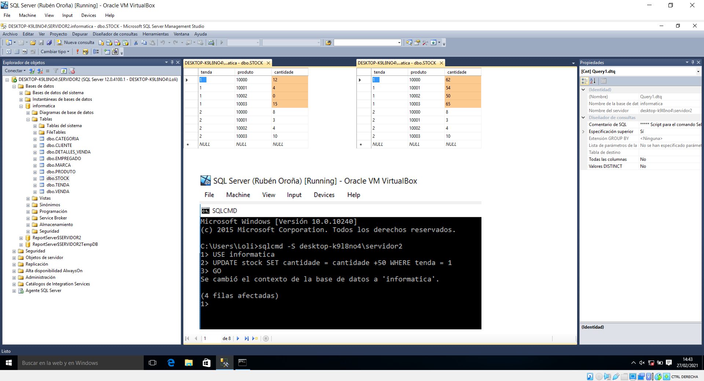
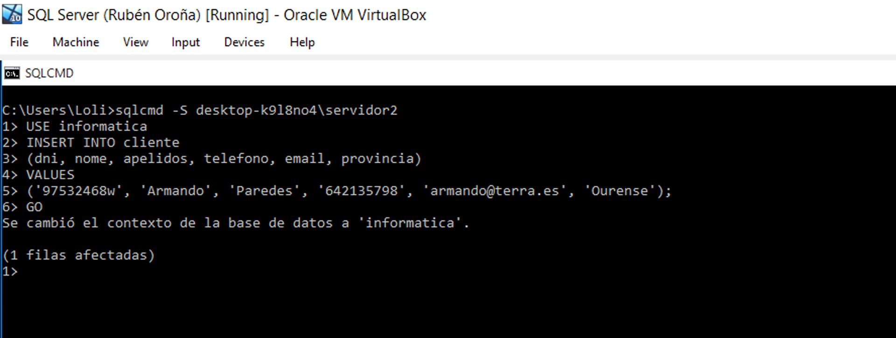
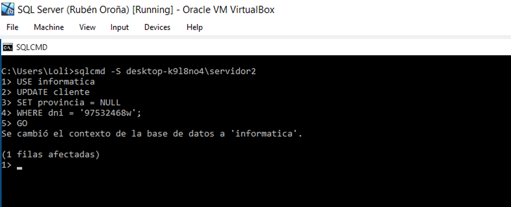
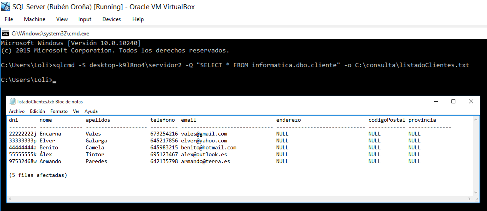
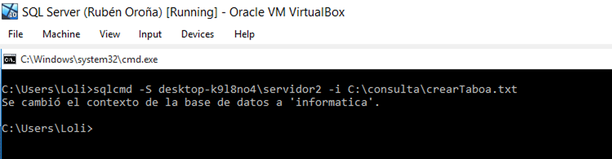
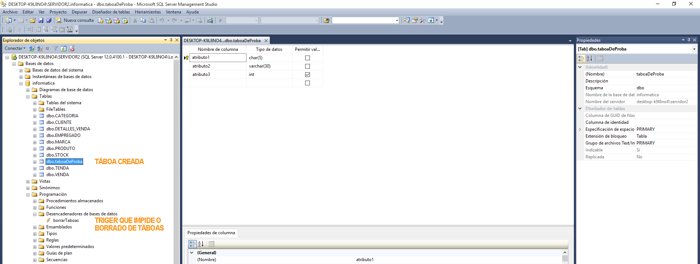
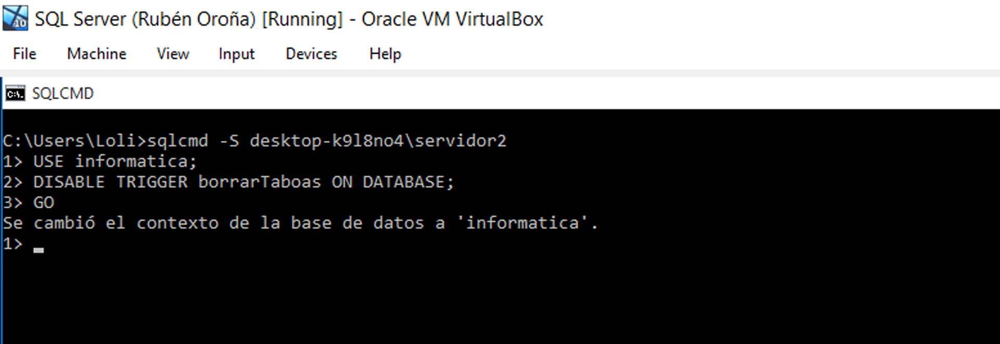
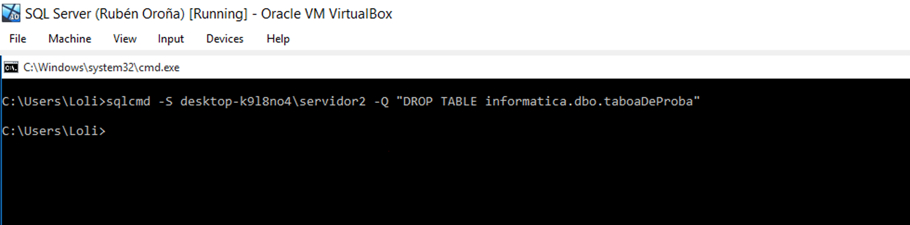
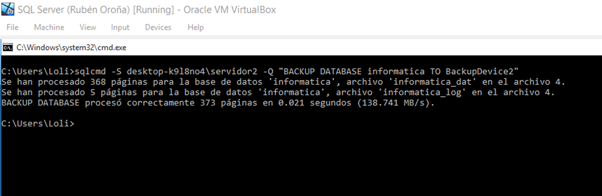
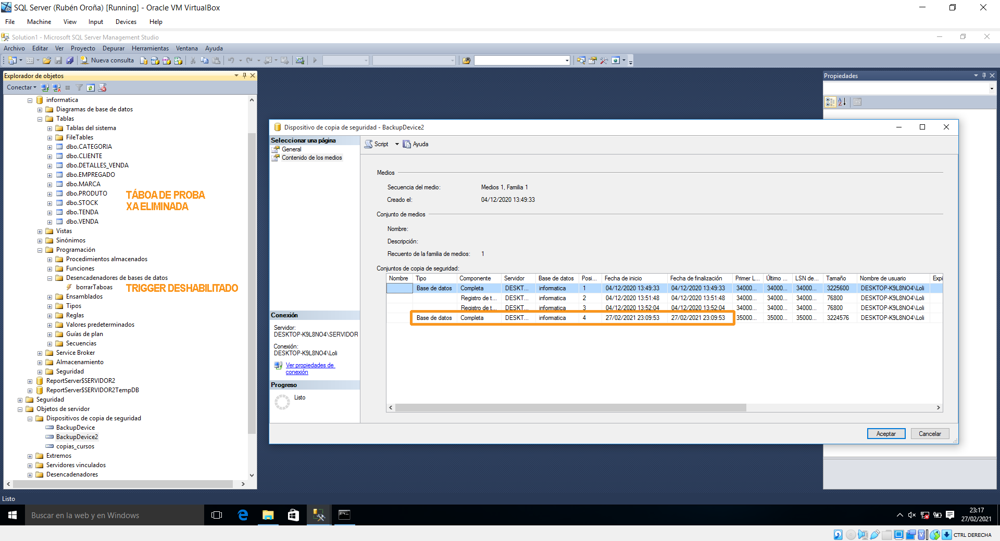

## 12. Execución de instrucións dende o símbolo do sistema

Se temos acceso a unha instancia SQL Server, pero por algún motivo non contamos coa GUI propia do servidor, poderemos empregar o cmd.exe. Así pois, mediante a utilidade **sqlcmd**, somos capaces de executar scripts e instrucións Transact-SQL, do mesmo xeito que faríamos dende a interface gráfica.

Para comezar a empregar esta utilidade, basta con abrir o símbolo do sistema dende un usuario cos suficientes privilexios e executar o comando sqlcmd. Esta táboa recolle os argumentos e comandos máis básicos:

| Sintaxe | Significado                                     |
|---------|-------------------------------------------------|
| **-S**  | Servidor ó que nos conectamos                   |
| **-E**  | Conexión de confianza (predeterminado)          |
| **-U**  | ID de inicio de sesión                          |
| **-P**  | Contrasinal                                     |
| **-q**  | Consulta na liña de comandos                    |
| **-Q**  | Consulta na liña de comandos + saír ó finalizar |
| **-i**  | Ruta de importación dun ficheiro                |
| **-o**  | Ruta de exportación dun ficheiro                |
| go      | Execución da caché de instrución                |
| exit    | Saír de sqlcmd                                  |


A execución de instrucións e scripts Transact-SQL mediante a utilidade sqlcmd pode ser **ad hoc** e **interactiva**. No noso caso, teremos que especificar de todas as veces a instancia á que nos queremos conectar, pois esta non é a predeterminada do servidor. Sen embargo, se non contamos con outra instancia ou realmente imos a traballar na primaria, basta con executar sqlcmd (sen argumentos) para entrar automaticamente no modo interactivo, podendo rexistrar varias liñas de código ata que todas son executadas mediante un GO. A modo de exemplo, imos realizar varias instrucións DML e DDL, introducindo tamén a posibilidade de importar e exportar ficheiros.

O primeiro exemplo DML que faremos será aumentar en 50 o número de existencias de todos produtos rexistrados na tenda1. Aínda que o predicado necesario é moi sinxelo, empregaremos o modo de conexión interactivo. Deste xeito, especificamos o nome da instancia a conectarnos co argumento -S, escollemos a base de datos a manexar e executamos a instrución Transact-SQL. Como comprobamos despois, o stock aumentou.




Ademais de modificar tuplas existentes, tamén podemos engadir entradas. No seguinte exemplo, imos rexistrar un novo cliente. Do mesmo xeito que no caso anterior, tamén será empregado o modo interactivo de sqlcmd.




Rematamos os exemplos DML eliminando a provincia do usuario que acabamos de rexistrar. Tecnicamente non será borrado, senón pasado a ```NULL```, xa que o atributo provincia admite valores nulos.




Tamén podemos facer consultas mediante sqlcmd. Para darlle un pouco de interese, non só imos a consultar toda a información rexistrada sobre os nosos clientes, senón que ademais esta será exportada a un ficheiro local no sistema. Neste caso, executaremos todo o proceso nunha soa liña.




O ficheiro de texto organiza o ancho das columnas por ```-``` guións , introducindo un por cada carácter máximo que admiten as columnas. Para poder ensinar o resultado nunha captura, tivemos que recortar os espazos en branco que quedaban nas columnas de apelidos, email e enderezo, xa que son atributos que admiten entradas moito máis longas do que en realidade temos rexistradas nas nosas tuplas de exemplo.

Agora imos a realizar un exemplo DDL a través de sqlcmd, engadindo unha nova táboa que modifique a estrutura existente da nosa base de datos. Para elo, usaremos a importación de arquivos, para así poder empregar un script co que crear dita táboa.

```sql
-- Sinxelo script almacenado fisicamente en C:\consulta\crearTaboa.txt

USE informatica
GO
CREATE TABLE taboaDeProba (
	atributo1	CHAR (5)	PRIMARY KEY,
	atributo2	VARCHAR (30)	NOT NULL,
	atributo3	INT
);
GO
```


Para executar este script dende sqlcmd, basta con indicar a instancia e especificar a ruta do ficheiro co argumento ```-i```.




Como podemos comprobar, esta sinxela táboa foi creada sen problemas na base de datos informática. No seguinte paso, imos a eliminala.




Como se pode ver no explorador de obxectos da captura superior, segue habilitado o trigger que impide o borrado de calquera táboa. Se tratásemos de reverter os cambios previos, en vez de eliminar a táboa de proba, saltaría a alarma coa mensaxe de erro creada no apartado 7 e desencadenaríase unha copia de seguridade. Para saltarnos isto temporalmente, imos a deshabilitar o trigger mediante o sqlcmd.




Con isto, o desencadenador queda deshabilitado, permitindo o borrado da táboa anterior, e rematando así os exemplos DDL realizados dende o símbolo do sistema.




Por último, cómpre destacar unha das instrucións máis útiles que podemos executar dende o sqlcmd, isto é, unha copia de seguridade.




Podemos comprobar que antes deshabilitamos o desencadenador a nivel de base de datos que impedía o borrado de táboas. Ademais, asegurámonos de que a copia de seguridade se produciu con éxito.


